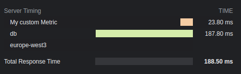

# Server-Timing API for Hono

[](https://github.com/PassiDel/hono-timing/actions)
[](https://github.com/PassiDel/hono-timing/blob/main/LICENSE)

[](https://www.npmjs.com/package/@puazzi/hono-timing)
[](https://www.npmjs.com/package/@puazzi/hono-timing)

This module adds [Server-Timing](https://www.w3.org/TR/server-timing/) to response headers
for [Hono](https://hono.dev/).

This middleware is based on the work of [yosuke-furukawa](https://github.com/yosuke-furukawa/server-timing), thank you!

# Install

```shell
npm install @puazzi/hono-timing
```

# Usage

```ts
import { serve } from '@hono/node-server';
import { Hono } from 'hono';
import { endTime, setMetric, startTime, timing } from "@puazzi/hono-timing";

const app = new Hono();

// add the middleware to your router
app.use('*', timing());

app.get('/', async (c) => {

  // add custom metrics
  setMetric(c, 'region', 'europe-west3')

  // add custom metrics with timing, must be in milliseconds
  setMetric(c, 'custom', 23.8, 'My custom Metric')

  // start a new timer
  startTime(c, 'db');
  const data = await db.findMany(...);

  // end the timer
  endTime(c, 'db');

  return c.json({ response: data });
});

serve(app);

```

## Conditionally enabled

```ts
import { Hono } from 'hono';
import { timing } from '@puazzi/hono-timing';

const app = new Hono();

app.use(
  '*',
  timing({
    // c: Context of the request
    enabled: (c) => c.req.method === 'POST'
  })
);
```

# API

## Config

| **Name**         | **Type**                           | **Default**           | **Description**                                                                                                                                                                                                                                                                                          |
| ---------------- | ---------------------------------- | --------------------- | -------------------------------------------------------------------------------------------------------------------------------------------------------------------------------------------------------------------------------------------------------------------------------------------------------- |
| total            | boolean                            | true                  | Show a total response time.                                                                                                                                                                                                                                                                              |
| enabled          | boolean \| (c: Context) => boolean | true                  | Whether timings should be added to the headers or not.                                                                                                                                                                                                                                                   |
| totalDescription | string                             | 'Total Response Time' | Description for the total response time.                                                                                                                                                                                                                                                                 |
| autoEnd          | boolean                            | true                  | If `startTime()` should end automatically at the end of the request. If disabled, not manually ended timers will not be shown.                                                                                                                                                                           |
| crossOrigin      | boolean \| string                  | false                 | The origin this timings header should be readable.<br>If false, only from current origin.<br>If true, from all origin.<br>If string, from this domain(s). Multiple domains must be separated with a comma.<br>See [docs](https://developer.mozilla.org/en-US/docs/Web/HTTP/Headers/Timing-Allow-Origin). |

# Result


